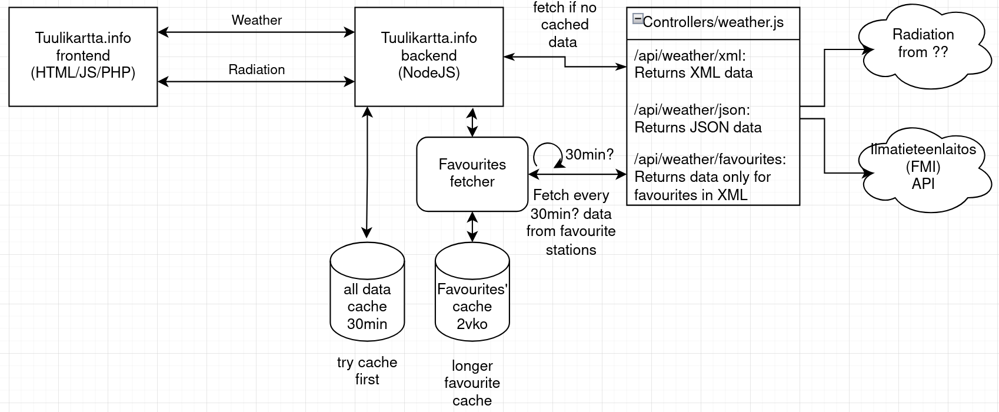

# Backend of Tuulikartta

This backend is a new part of the Tuulikartta and handles API data fetching, parsing and caching. 

## Overview

A small Node.js / Express backend that fetches weather observation data from the APIs describes in the front page of the repo, parses XML responses, and exposes cleaned JSON data.

## Features

- Fetches data from FMI and other APIs
- Parses XML using `xml2js`
- Extracts weather station names, FMIS IDs, coordinates and more
- Returns normalized JSON
- Simple Express API
- Configuration of backend in 'config.js'
- Caching with sqlite



## Getting Started

### Prerequisites
- Node.js (v14+)
- npm or yarn
- Docker and Docker Compose

### Tech Stack

- Node.js
- Express
- node-fetch
- node-cron
- xml2js
- Redis
- Luxon
- better-sqlite3

### Running the Server with nodemon

This server should be used with Docker compose. Other wise manual dependecy installation is needed. To run this server independently use: 

```bash
docker compose -f docker-compose.dev.yml up -d
```

The server will start on the configured port (default: 3000).

## API Endpoints

### `GET /api/weather/latest`

Returns latest weather observations. Supports optional historical lookup via `time` query.

* **Query params:**

  * `time` *(optional)*: `"now"` or ISO timestamp
* **Behavior:**

  * Uses SQLite cache when data is close enough (±10 min)
  * Falls back to FMI API if not cached
  * Rejects future timestamps (`400`)
* **Response:**
  List of station observations with weather data and aggregated values
 
---

### `GET /api/weather/favourites`

Returns latest weather observations for favourite stations.

* **Query params:**

  * `time` *(optional)*: `"now"` or ISO timestamp
* **Behavior:**

  * Without `time`: returns most recent observation per favourite station
  * With `time`: returns closest observations within ±5 minutes
  * Uses fallback logic to avoid empty latest batches
* **Response:**
  List of favourite station observations with weather data and aggregated values
* **Errors:**

  * `404` if no data is found
  * `500` on internal server error

---

### `GET /api/weather/favourites/graph`

Returns a 24-hour time series (synop data) for a single favourite station.

* **Query params:**

  * `fmisid` *(required)*: station ID
  * `time` *(optional)*: `"now"` or ISO timestamp
* **Behavior:**

  * Returns data for the last 24 hours ending at `time` (or now)
  * Data is pulled from SQLite cache only
  * Rejects invalid, missing, or future timestamps
* **Response:**
  Time series of weather observations for the selected station
* **Errors:**

  * `400` missing/invalid parameters
  * `404` no cached data found
  * `500` internal error

---

### `GET /api/road/obs`

Returns road weather observations from Digitraffic.

* **Query params:**

  * `time` *(optional)*: `"now"` or ISO timestamp
* **Behavior:**

  * Rejects future timestamps (`400`)
  * Falls back to current time if timestamp is invalid
  * Fetches station metadata + observation data from Digitraffic API
  * Parses and combines data before returning results
  * Uses timeout protection for external API calls
* **Response:**
  Road weather observations for all stations at the requested time
* **Errors:**

  * `400` invalid/future timestamp
  * `500` external API failure or timeout

---

### `GET /api/road/obs/:stationId`

Returns road weather observations for a specific station from Digitraffic.

* **Path params:**

  * `stationId` *(required)*: ID of the road weather station
* **Query params:**

  * `time` *(optional)*: `"now"` or ISO timestamp
* **Behavior:**

  * Rejects future timestamps (`400`)
  * Falls back to current time if timestamp is invalid
  * Fetches station metadata and observation data from Digitraffic API
  * Parses and returns a single station’s observation at the requested time
* **Response:**
  Road weather data for the specified station
* **Errors:**

  * `400` invalid/future timestamp
  * `500` external API failure or timeout

---

### `GET /api/road/cameras`

Returns road camera data from Digitraffic.

* **Query params:**

  * `time` *(optional)*: `"now"` or ISO timestamp
* **Behavior:**

  * Converts requested time into UTC format for processing
  * Fetches camera metadata and image/data endpoints from Digitraffic
  * Parses and combines results into a unified response
  * Handles HTTP errors from external API calls
* **Response:**
  List of road cameras with latest available images/data for the requested time
* **Errors:**

  * `500` failed to fetch or parse camera data

---

### `GET /api/road/cameras/:stationId/history`

Returns historical camera data for a specific road camera station.

* **Path params:**

  * `stationId` *(required)*: ID of the camera station
* **Behavior:**

  * Fetches camera history directly from Digitraffic API
  * Validates HTTP response before returning data
* **Response:**
  Historical image/data records for the specified camera station
* **Errors:**

  * `500` failed to fetch or retrieve camera history

---

### `GET /api/road/cameras/:stationId`

Returns road camera data for a specific station from Digitraffic.

* **Path params:**

  * `stationId` *(required)*: ID of the camera station
* **Query params:**

  * `time` *(optional)*: `"now"` or ISO timestamp
* **Behavior:**

  * Converts requested time to UTC format for processing
  * Fetches station metadata and camera data from Digitraffic API
  * Parses and returns the latest available camera data for the station
  * Validates external API responses before processing
* **Response:**
  Camera data for the specified station at the requested time
* **Errors:**

  * `500` failed to fetch or parse camera data

---

### `GET /api/radiation/rvalue`

Returns R values (radiation observations) from the FMI space API.

* **Behavior:**

  * Fetches latest R-value observations from external FMI service
  * Logs number of returned observations
  * Returns raw dataset without additional transformation
* **Response:**
  List of radiation (R-value) observations
* **Errors:**

  * `500` failed to fetch data or request timeout

---

### `GET /api/radiation/external`

Returns external radiation data from STUK / FMI API.

* **Query params:**

  * `time` *(optional)*: `"now"` or ISO timestamp
* **Behavior:**

  * Builds request URL based on requested time
  * Fetches XML radiation data from external STUK FMI service
  * Parses multipoint coverage XML into structured JSON
  * Uses timeout protection for external request
* **Response:**
  Parsed radiation observations (DR_PT10M_avg values)
* **Errors:**

  * `500` external API failure or timeout

---

### `GET /api/radiation/external/:stationId`

Returns external radiation time series data for a specific station from STUK / FMI API.

* **Path params:**

  * `stationId` *(required)*: station FMISID
* **Query params:**

  * `time` *(optional)*: `"now"` or ISO timestamp
* **Behavior:**

  * Builds request URL for station-specific radiation graph data
  * Adds timestamp range for time series retrieval
  * Fetches XML data from STUK FMI API with timeout protection
  * Parses multipoint coverage XML into structured JSON (including epoch time)
* **Response:**
  Radiation time series data for the specified station
* **Errors:**

  * `500` external API failure or timeout

---

### `GET /api/radiation/nuclides`

Returns nuclide radiation data from STUK FMI API.

* **Query params:**

  * `time` *(optional)*: `"now"` or ISO timestamp
* **Behavior:**

  * Builds a 90-day time range based on requested timestamp
  * Fetches XML nuclide data from external STUK API with timeout protection
  * Parses multipoint coverage XML into structured JSON
* **Response:**
  Nuclide radiation measurements over the selected time range
* **Errors:**

  * `500` external API failure or timeout

---


